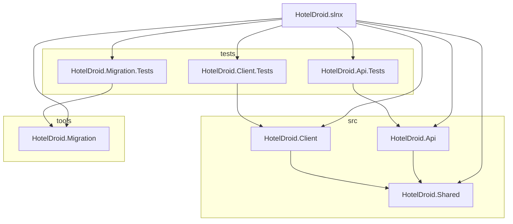
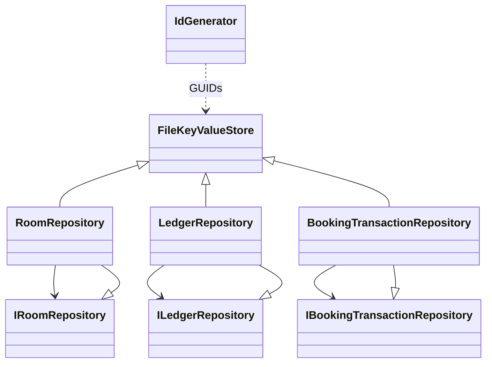
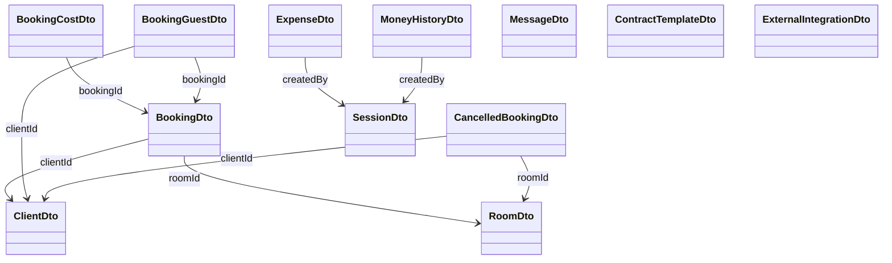
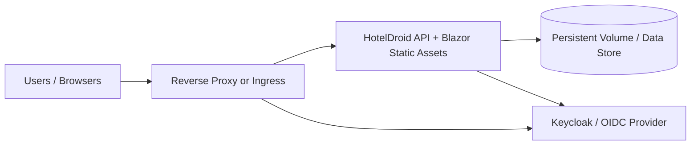

# HotelDruid Blazor Migration - System Architecture

**Date**: 2026-02-15  
**Status**: Design - Ready for Implementation  
**Version**: 1.0

---

## Executive Summary

This document defines the architectural decisions for migrating HotelDruid from a PHP/MySQL monolith to a Blazor WASM frontend with an ASP.NET Core API backend, backed by a file-based key-value store with immutable ledger tracking.

**Key Principles:**
- Explicit data storage (no computed defaults)
- Immutable audit trail via ledger
- Self-healing indexes
- Simple, robust concurrency via in-memory mutexes
- Scalable naming scheme using GUID-base32

---

## 1. Concurrency Strategy

### In-Process, In-Memory Mutex (SemaphoreSlim)

**Decision**: No file locks. Single-process coordination via `SemaphoreSlim`.

**Rationale:**
- The API is the single gateway for all data mutations
- All concurrent requests are handled by ASP.NET Core's thread pool
- SemaphoreSlim serializes writes per-collection
- Atomic file operations (temp → rename) guarantee safety even if process crashes
- No distributed locking complexity needed for local/single-server deployment

**Implementation:**
```csharp
private readonly Dictionary<string, SemaphoreSlim> _collectionLocks
    = new Dictionary<string, SemaphoreSlim>();

// When writing:
using (await _locks.GetOrAdd(collectionName, _ => new SemaphoreSlim(1)).WaitAsync())
{
    var tempPath = filePath + ".tmp";
    await File.WriteAllTextAsync(tempPath, json);
    File.Move(tempPath, filePath, overwrite: true);  // Atomic
}
```

**Guarantees:**
- ✅ No partial writes (temp file ensures atomicity)
- ✅ No race conditions (SemaphoreSlim serializes per-collection)
- ✅ Safe concurrent reads (no lock required)
- ✅ Single-threaded semantics for writes

---

## 2. Identity & Naming Scheme

### GUID-Base32 for Static Assets

**Decision**: Use GUID converted to base32 as file identifiers.

**Why Base32:**
- 32 uniqueness per 5 bits (A-Z, 2-7)
- URL-safe (RFC 4648)
- Compact: 22 characters per GUID
- No special escaping needed

**Implementation:**
```csharp
public static string GenerateId()
{
    var guid = Guid.NewGuid();
    return Convert.ToBase64String(guid.ToByteArray())
        .Replace("+", "-")
        .Replace("/", "_")
        .TrimEnd('=')
        .Substring(0, 22);
}
```

**Example IDs:**
- `a1b2c3d4e5f6g7h8i9j0k1` (22 chars, unique, URL-safe)

---

## 3. Storage Model: Two Layers

### Layer 1: Mutable State (Current Configuration)

**Collections** (directories under `data/collections/`):
- `rooms/` — current room definitions
- `rateplans/` — current pricing plans
- `guests/` — current guest records
- `templates/` — contract and email templates
- `settings/` — application configuration
- `bookings/` — current booking state

**Structure:**
```
data/
  collections/
    rooms/
      _index.json                      ← Human-readable mapping
      a1b2c3d4e5f6g7h8i9j0k1l2.json   ← GUID-base32 data file
      b2c3d4e5f6g7h8i9j0k1l2m3.json
```

**Index file** (`_index.json`):
```json
{
  "_metadata": {
    "version": "1",
    "lastRebuilt": "2025-12-14T10:00:00Z",
    "collectionName": "rooms"
  },
  "Room-1": "a1b2c3d4e5f6g7h8i9j0k1l2",
  "Room-2": "b2c3d4e5f6g7h8i9j0k1l2m3",
  "Standard-Double": "c3d4e5f6g7h8i9j0k1l2m3n4"
}
```

**Index Characteristics:**
- ✅ Maps human-readable names to GUID-base32 filenames
- ✅ Allows quick lookup without scanning all files
- ✅ Can be **rebuilt on-demand** by scanning data files (self-healing)
- ✅ Updated atomically whenever a new asset is created/renamed

**Data file** (e.g., `a1b2c3d4e5f6g7h8i9j0k1l2.json`):
```json
{
  "id": "a1b2c3d4e5f6g7h8i9j0k1l2",
  "name": "Room-1",
  "capacity": 2,
  "pricePerNight": 50,
  "roomType": "Standard"
}
```

### Layer 2: Immutable Ledger (Transaction History)

**Collections** (time-partitioned):
- `ledger/` — global financial/booking transaction ledger
- `bookings/{bookingId}_transactions/` — per-stay transaction ledger

**Ledger Structure:**
```
data/
  ledger/
    2025/
      12/
        14/
          _snapshot.json              ← State at 2025-12-14T00:00:00Z
          _seq_001.json               ← Transaction #1
          _seq_002.json               ← Transaction #2
          _seq_003.json               ← Transaction #3
        15/
          _snapshot.json              ← State at 2025-12-15T00:00:00Z
          _seq_001.json
```

**Daily Snapshot** (`_snapshot.json`):
```json
{
  "date": "2025-12-14",
  "timestamp": "2025-12-14T00:00:00Z",
  "entries": [
    {
      "id": "ledger_entry_001",
      "type": "booking_offer",
      "bookingId": "B001",
      "charges": 180.00,
      "status": "confirmed"
    }
  ],
  "totalDayBalance": 1250.00,
  "sequenceAt": 0
}
```

**Incremental Sequence Entry** (`_seq_001.json`):
```json
{
  "sequence": 1,
  "timestamp": "2025-12-14T10:30:45Z",
  "type": "payment",
  "bookingId": "B001",
  "amount": 180.00,
  "method": "card",
  "status": "completed",
  "createdBy": "staff@hotel.com"
}
```

**Ledger Characteristics:**
- ✅ **Append-only**: Never updated or deleted
- ✅ **Timestamped**: Every entry has exact time
- ✅ **Immutable snapshots**: Daily state captured
- ✅ **Incremental sequences**: Only changes since snapshot
- ✅ **Self-documenting**: Full context captured (rates, guest info, charges at time of transaction)
- ✅ **Efficient**: Load snapshot + apply N sequences instead of 10K+ entries

---

## 4. Explicit Data Storage (No Computed Defaults)

### Principle: Store Everything, Omit Only Empty/Zero Values

**Decision**: Persist all non-empty values. No defaults computed at read time.

**Rationale:**
- Historical accuracy: old records retain the values they were created with
- Rate changes don't retroactively alter old bookings
- Audit trail: exactly what was set when
- No surprises from changing defaults

**Example:**

```json
// ✅ CORRECT: Store what was explicitly set
{
  "id": "a1b2c3d4e5f6g7h8i9j0k1l2",
  "name": "Room-1",
  "capacity": 2,
  "pricePerNight": 50,      // ← Explicit even if it matches config default
  "roomType": "Standard",
  "amenities": []            // ← Can omit empty arrays
}

// ❌ WRONG: Don't omit defaults and apply them at read time
{
  "id": "a1b2c3d4e5f6g7h8i9j0k1l2",
  "name": "Room-1",
  "capacity": 2
  // Missing pricePerNight — will be filled later (bad!)
}
```

**Rules:**
- Store every field that has a non-default value
- Omit only: empty strings, empty arrays/objects, zero for numeric where truly optional
- If a client sends a value, even if it matches default, persist it

**Ledger Storage:**
- All snapshot fields are explicit (no defaults computed)
- Captures exact state at time of transaction

---

## 5. Storage Schema: Rooms (First Implementation)

### Room Model

**API Shape** (what clients work with):
```csharp
public class Room
{
    public string Id { get; set; }              // GUID-base32
    public string Name { get; set; }            // e.g., "Room-1"
    public int Capacity { get; set; }           // e.g., 2
    public string RoomType { get; set; }        // e.g., "Standard", "Deluxe"
    public decimal PricePerNight { get; set; }  // e.g., 50.00
    public List<string> Amenities { get; set; } // e.g., ["WiFi", "AC"]
    public bool IsAvailable { get; set; }       // e.g., true
}
```

**Storage Shape** (`rooms/{id}.json`):
```json
{
  "id": "a1b2c3d4e5f6g7h8i9j0k1l2",
  "name": "Room-1",
  "capacity": 2,
  "roomType": "Standard",
  "pricePerNight": 50,
  "amenities": ["WiFi", "AC"],
  "isAvailable": true
}
```

**Index** (`rooms/_index.json`):
```json
{
  "_metadata": {
    "version": "1",
    "lastRebuilt": "2025-12-14T10:00:00Z"
  },
  "Room-1": "a1b2c3d4e5f6g7h8i9j0k1l2",
  "Room-2": "b2c3d4e5f6g7h8i9j0k1l2m3"
}
```

---

## 6. Ledger Schema: Booking Offer

### Immutable Ledger Entry (Booking Offer)

**Purpose**: Capture all relevant data at the moment an offer is created.

**Structure:**
```json
{
  "id": "ledger_20251214_001",
  "entryType": "booking_offer",
  "timestamp": "2025-12-14T10:30:00Z",
  "createdBy": "staff@hotel.com",
  "status": "confirmed",

  "bookingId": "B001",
  "guestId": "G001",
  "roomId": "R001",

  "booking": {
    "checkIn": "2025-12-20",
    "checkOut": "2025-12-23",
    "nights": 3,
    "guestName": "John Doe",
    "guestEmail": "john@example.com",
    "specialRequests": "Late checkout"
  },

  "rateAtTime": {
    "pricePerNight": 50.00,
    "roomType": "Standard",
    "cancellationPolicy": "Free until 7 days before",
    "taxRates": {"VAT": 0.15}
  },

  "charges": {
    "roomCharges": 150.00,
    "taxAmount": 22.50,
    "discount": 0,
    "total": 172.50,
    "breakdown": {
      "room_3_nights": 150.00,
      "VAT_15%": 22.50
    }
  },

  "guestSnapshot": {
    "name": "John Doe",
    "email": "john@example.com",
    "phone": "+1-555-1234",
    "address": "123 Main St"
  },

  "notes": "Standard booking"
}
```

**Characteristics:**
- ✅ Captures exact rate at time of offer
- ✅ Records guest info as it was
- ✅ Shows calculated charges
- ✅ Immutable and timestamped
- ✅ Allows historical accuracy (old bookings show old rates)

---

## 7. Solution Structure (2026)

### Project/Folder Overview



---

## 8. Call Hierarchy and Repository Groups



---

## 9. Entity/DTO Hierarchy



---

## 10. Booking Transaction Tracking

### Per-Stay Transaction Sequence

**Structure:**
```
data/
  bookings/
    a1b2c3d4e5f6g7h8i9j0k1l2.json         ← Current booking state
    a1b2c3d4e5f6g7h8i9j0k1l2_transactions/
      _index.json                         ← Tracks all txns
      _seq_001.json                       ← Checkin charge
      _seq_002.json                       ← Additional charge
      _seq_003.json                       ← Payment received
```

**Transaction Entry** (`_seq_001.json`):
```json
{
  "bookingId": "a1b2c3d4e5f6g7h8i9j0k1l2",
  "sequence": 1,
  "timestamp": "2025-12-20T15:00:00Z",
  "type": "checkin_charge",
  "amount": 180.00,
  "description": "Room charge for 3 nights",
  "appliedTo": "stay_balance",
  "createdBy": "system"
}
```

**Characteristics:**
- ✅ One sequence file per transaction
- ✅ Ordered by sequence number (1, 2, 3...)
- ✅ Tied to booking via directory and `bookingId` field
- ✅ Full audit trail for a single stay

---

## 11. Repository Interface Design

### IAssetRepository<T> (Static Assets)

Used for: Rooms, RatePlans, Guests, Templates, Settings

```csharp
public interface IAssetRepository<T> where T : class
{
    // Lookup by human-readable name (via index)
    Task<T> GetByNameAsync(string name);

    // Lookup by GUID-base32 ID (direct file access)
    Task<T> GetByIdAsync(string id);

    // Create new asset (auto-generates GUID, updates index)
    Task<string> CreateAsync(string name, T data);

    // Update existing asset
    Task UpdateAsync(string id, T data);

    // List all assets
    Task<List<T>> ListAsync();

    // Rebuild index from data files
    Task RebuildIndexAsync();

    // Get raw index for introspection
    Task<Dictionary<string, string>> GetIndexAsync();
}
```

### ILedgerRepository (Transaction History)

```csharp
public interface ILedgerRepository
{
    // Get daily snapshot
    Task<LedgerSnapshot> GetSnapshotAsync(DateTime date);

    // Store daily snapshot
    Task SaveSnapshotAsync(DateTime date, LedgerSnapshot snapshot);

    // Append entry (auto-assigns sequence)
    Task<LedgerEntry> AppendEntryAsync(DateTime date, LedgerEntry entry);

    // Query incremental entries
    Task<List<LedgerEntry>> GetEntriesSinceSequenceAsync(DateTime date, int fromSequence);

    // Get all entries for a day
    Task<List<LedgerEntry>> GetEntriesForDateAsync(DateTime date);

    // Get all entries for a booking across date range
    Task<List<LedgerEntry>> GetEntriesForBookingAsync(
        string bookingId, DateTime from, DateTime to);

    // Consolidate snapshot + sequences into single view
    Task<List<LedgerEntry>> GetConsolidatedAsync(DateTime date);
}
```

### IBookingTransactionRepository (Per-Stay Ledger)

```csharp
public interface IBookingTransactionRepository
{
    // Append transaction (auto-assigns sequence)
    Task<BookingTransaction> AppendTransactionAsync(
        string bookingId, BookingTransaction txn);

    // Get all transactions for a booking
    Task<List<BookingTransaction>> GetTransactionsAsync(string bookingId);

    // Get next sequence number
    Task<int> GetNextSequenceAsync(string bookingId);
}
```

---

## 12. Implementation Phases

### Phase 1A: Core Storage Layer (Days 1-2)

**Deliverable**: Generic file-based KV store with concurrency

**Components:**
1. `FileKeyValueStore` class
   - `GetAsync<T>(collection, id)`
   - `CreateAsync<T>(collection, name, data)` → returns GUID
   - `UpdateAsync<T>(collection, id, data)`
   - `DeleteAsync(collection, id)`
   - `ListAsync<T>(collection)`
   - Atomic writes with SemaphoreSlim
   - Index management

2. `IdGenerator` utility
   - GUID → base32 conversion

3. Unit tests
   - Concurrent writes
   - Atomic crash safety
   - Index rebuild

**Non-deliverable yet:**
- Ledger (Phase 1B)
- Booking transactions (Phase 1B)

---

### Phase 1B: Storage Repositories (Days 3-4)

**Deliverable**: Room repository + basic ledger

**Components:**
1. `IRoomRepository` implementation
   - Uses `FileKeyValueStore`
   - Validation (no duplicate names, capacity bounds)
   - CRUD + listing

2. `ILedgerRepository` implementation
   - Daily snapshots
   - Incremental sequences
   - Consolidation logic

3. `IBookingTransactionRepository` implementation
   - Per-stay sequence tracking

4. Unit tests
   - Repository CRUD
   - Ledger consolidation
   - Booking transaction ordering

---

### Phase 2: API Endpoints (Days 5-6)

**Deliverable**: REST endpoints for rooms

**Endpoints:**
- `GET /api/rooms` — list all
- `GET /api/rooms/{id}` — get by ID
- `GET /api/rooms?name=Room-1` — get by name
- `POST /api/rooms` — create
- `PUT /api/rooms/{id}` — update
- `DELETE /api/rooms/{id}` — delete

**Features:**
- OpenAPI/Swagger documentation
- Proper HTTP status codes
- Error handling

---

### Phase 3: Blazor UI (Days 7-8)

**Deliverable**: Room list and management UI

**Pages/Components:**
- Room list view
- Room detail view
- Create/edit modal
- Delete confirmation

---

## 13. Key Design Decisions Reference

| Decision | Rationale | Implication |
|----------|-----------|------------|
| **In-memory mutex** | API is single process | Simple, no file locks |
| **GUID-base32 IDs** | Unique, URL-safe, compact | Self-documenting, no counter management |
| **Index files** | Name → ID mapping | Quick lookups, self-healing |
| **Explicit storage** | Historical accuracy | No defaults at read time |
| **Daily snapshots + sequences** | Performance + history | Avoid loading 10K+ files daily |
| **Immutable ledger** | Audit trail | Conflict resolution, compliance |
| **Per-booking transactions** | Transparency | Full stay history visible |
| **Atomic writes** | Crash safety | No partial file corruption |


## Container Deployment Profiles (Neutral)

For hosted, publicly accessible deployments, the architecture is intentionally
provider-neutral. The application does not hardcode a single reverse proxy,
certificate automation provider, or identity provider. Those are deployment
profile choices selected by administrators.

**Profile dimensions:**
- Reverse proxy mode: `nginx`, `caddy`, `traefik`, or platform ingress
- TLS mode: `self-signed` (internal only), `acme`, or externally managed certs
- Access mode: `private` (internal network) or `public`
- Auth mode: `keycloak-oidc`, another OIDC provider, or enterprise SSO gateway

**Security baseline:**
- Public profiles should require authentication and authorization.
- No public profile should be documented as anonymous by default.

**Recommended scenario set:**
- Internal validation: `self-signed + private + auth optional by policy`
- Public production: `acme + public + keycloak-oidc`
- Enterprise production: `external cert + public + keycloak-oidc`

**Why Keycloak is a strong option:**
- Centralized user, role, and realm management
- Standard OIDC/OAuth2 support for app and proxy integration
- SSO/MFA support for hardened public access
- Scales well in containerized deployments

### Scalable Container Topology



**Scalability notes:**
- Run multiple API replicas behind a reverse proxy/ingress.
- Keep identity and TLS termination outside application code.
- Persist data on durable volumes and plan for backup/restore workflows.
- Add health checks and readiness probes at proxy and API layers.

---

## 15. Getting Started

**Next Steps:**
1. Create `src/HotelDroid.Services/` project
2. Implement `FileKeyValueStore` with unit tests
3. Implement `IRoomRepository` with unit tests
4. Create `/api/rooms` endpoints
5. Wire Blazor UI to API

**Testing Strategy:**
- Unit tests for concurrency (multiple threads)
- Integration tests for file I/O
- HTTP client tests for API endpoints
- Manual testing with Postman

---

## 16. Future Considerations

**Scalability Options** (when/if needed):
- SQLite backend (instead of files) — drop-in replacement via same repository interfaces
- Multi-instance deployment — would need distributed locking or message queue
- Cloud migration — ledger + snapshots make this natural

**Features** (Phases 2+):
- Export/import ZIP packages (canonical format)
- i18n (en, es, it)
- Advanced billing logic
- Integration APIs


---

## References

- [Architecture Decision Log](ARCHITECTURE.md) (this file)
- Implementation code in `src/HotelDroid.Api/`
